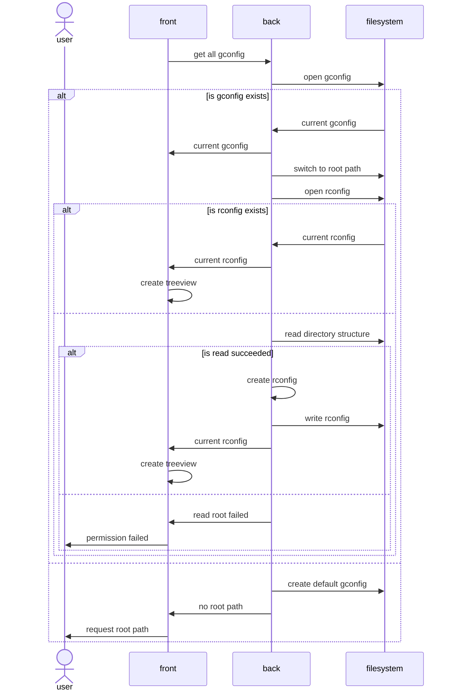
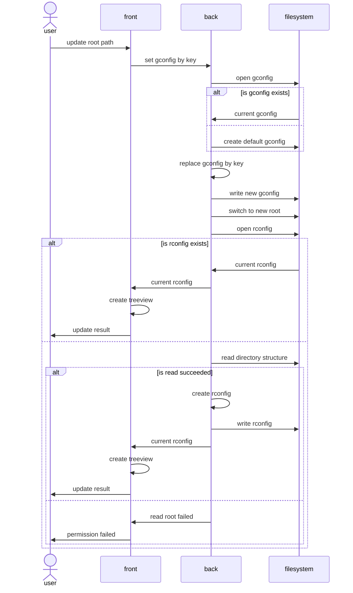
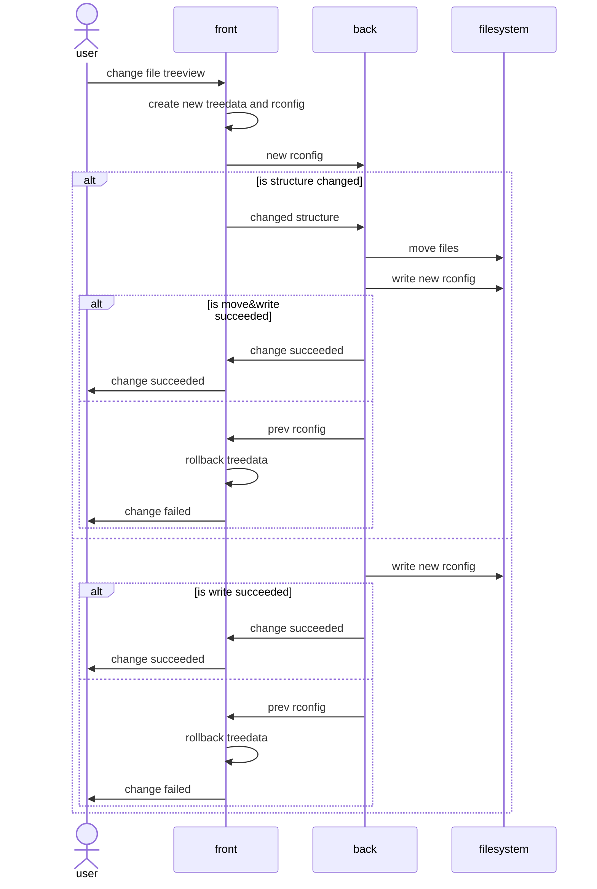

# Rescue MD Notebook

😊

## Configuration files
- global config (gconfig)
  - current root directory
  - color mode
  - language
- root config (rconfig)
  - filetree
    - treedata
    - opened node

## Tauri backend commands
Those commands must be inspired by sequences.  
WIP

## Sequence examples
### Startup

### Update root path

### Filetree changed
